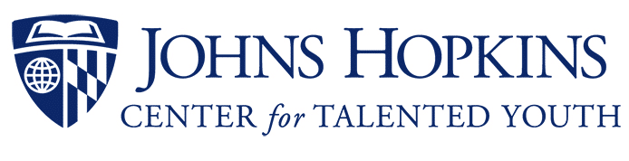

# JHU-CTY

This is a repository of turned in work for the Center for Talented Youth at Johns Hopkins University, `Investigations in Engineering`.  

This course was taught by  
[Dr. Manuela Badea](https://www.linkedin.com/in/manuela-codruta-badea-phd-0952644)
 
and TA. Yarin C.A.

Throughout the 3 week course, we completed lots of labs, and projects, with each of them documented here. I chose to do most of my writeups in notebooks, as it seemed like a great tool when working with datasets and calculations. I tried R, but Im better with np and pandas haha.

Check it out. CTY is fun